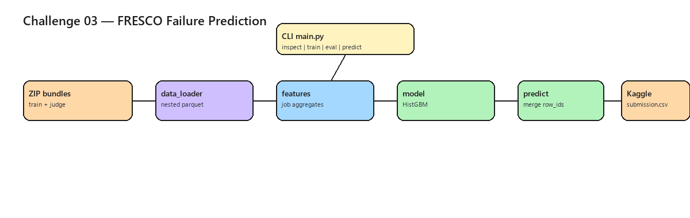

# GSC 2026 — Challenge 03: FRESCO Early Job Failure Prediction

IEEE Global Student Challenge — predict whether HPC jobs will fail or timeout using the FRESCO dataset.

## Architecture



*Editable source: [`docs/architecture.excalidraw`](docs/architecture.excalidraw) — regenerate PNG with `python scripts/generate_architecture_png.py`*

## Phase I progress check-in (2026-07-26)

| Item | Status |
|------|--------|
| README | Done |
| Kaggle baseline submit | Done (0.24 constant-probability) |
| Parquet parsing + sklearn pipeline | Feature 1 |
| ~100 LOC in `src/` | Feature 1 target |

## Competition

- Kaggle: [FRESCO Early Job Failure Prediction Challenge](https://www.kaggle.com/competitions/fresco-early-job-failure-prediction-challenge)
- Repo: https://github.com/NadaAOUITI/GSC26-Challenge3-256

## Data setup

1. Download from Kaggle (or use ZIP bundles at project root):
   - `training_data_bundle.zip`
   - `unlabeled_judge_data_bundle.zip`
   - `data/sample_submission.csv`

2. See [`data/data-chunk-info.txt`](data/data-chunk-info.txt) for train/validation/judge splits.

## Quick start

```bash
python -m venv .venv
.venv\Scripts\activate
pip install -r requirements.txt

python -m src.main inspect --limit 3
python -m src.main train --limit 200
python -m src.main eval --limit 200
python -m src.main predict --output output/submission.csv
```

Upload `output/submission.csv` to Kaggle.

## Project layout

```text
GSC3/
  data/              # sample_submission.csv, chunk info
  dataset/           # notes (ZIP bundles stay at repo root)
  src/               # data_loader, features, model, predict, CLI
  tests/
  docs/adr/
  output/            # model + submission (gitignored)
```

## Target definition

- **Label 1:** FAILED, TIMEOUT, NODE_FAIL
- **Label 0:** COMPLETED
- **Submission:** `row_id`, `failure_probability` (e.g. `Anvil_JOB1009129`)

## Team

Global Student Challenge 2026 — Challenge 03.
